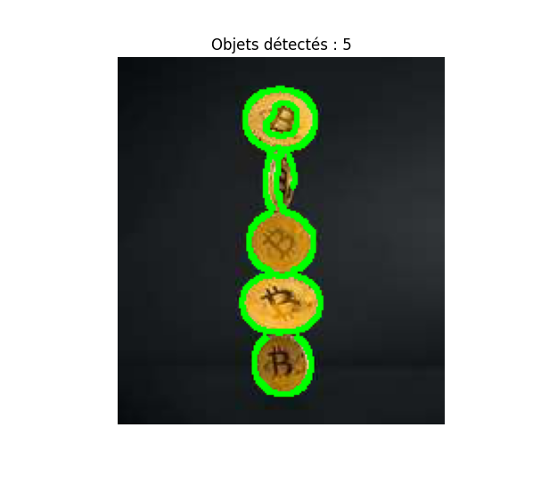

<!DOCTYPE html>
<html lang="pt-BR">
<head>
    <meta charset="UTF-8">
</head>

<body>

<h1>🧮 Contagem de Objetos – Python & OpenCV</h1>

<h2>📌 Descrição do Projeto</h2>

Este projeto consiste em uma aplicação de <strong>Visão Computacional</strong>
desenvolvida em <strong>Python</strong>, utilizando a biblioteca
<strong>OpenCV</strong> para <strong>detectar e contar automaticamente objetos
presentes em uma imagem</strong>.

O algoritmo utiliza técnicas clássicas de processamento de imagens, como
detecção de bordas e análise de contornos, sem o uso de modelos de
Deep Learning.

O objetivo principal do projeto é aplicar conceitos de:

<ul>
    <li>Processamento de imagens</li>
    <li>Visão computacional com OpenCV</li>
    <li>Detecção de contornos</li>
    <li>Análise e contagem de objetos</li>
</ul>

---

<h2>⚙️ Funcionalidades</h2>

<ul>
    <li>Leitura de imagens estáticas</li>
    <li>Conversão da imagem para escala de cinza</li>
    <li>Redução de ruído com filtro Gaussiano</li>
    <li>Detecção de bordas usando o algoritmo Canny</li>
    <li>Identificação automática de objetos</li>
    <li>Desenho de contornos nos objetos detectados</li>
    <li>Contagem total de objetos na imagem</li>
</ul>

---

<h2>🧰 Tecnologias Utilizadas</h2>

<ul>
    <li><strong>Python 3</strong></li>
    <li><strong>OpenCV</strong> (processamento de imagens)</li>
    <li><strong>NumPy</strong> (operações numéricas)</li>
    <li><strong>Matplotlib</strong> (visualização da imagem final)</li>
</ul>

---

<h2>📂 Estrutura do Projeto</h2>

<pre>
object_counter/
│
├── object_counter.py
├── coins.jpg
├── images/
│   └── resultado.png
├── README.html
</pre>

---

<h2>▶️ Como Executar o Projeto</h2>

<ol>
    <li>Certifique-se de ter o Python 3 instalado</li>
    <li>Instale as dependências necessárias:</li>
</ol>

<pre>
pip install opencv-python numpy matplotlib
</pre>

<ol start="3">
    <li>Execute o arquivo principal:</li>
</ol>

<pre>
python object_counter.py
</pre>

---

<h2>⚙️ Funcionamento do Algoritmo</h2>

<ol>
    <li>Carregamento da imagem original</li>
    <li>Conversão para escala de cinza</li>
    <li>Aplicação de desfoque Gaussiano para redução de ruídos</li>
    <li>Detecção de bordas com o algoritmo Canny</li>
    <li>Dilatação das bordas para reforçar os contornos</li>
    <li>Detecção dos contornos externos</li>
    <li>Desenho dos contornos e contagem dos objetos</li>
</ol>

---

<h2>📊 Exemplo de Resultado</h2>

A imagem abaixo apresenta o resultado final do processamento,
onde cada objeto detectado é destacado por um contorno verde,
e o número total de objetos é exibido no console.

---

<h2>🧪 Possíveis Problemas e Limitações</h2>

<ul>
    <li>Objetos muito próximos podem ser detectados como um único objeto</li>
    <li>Ruídos na imagem podem gerar falsas detecções</li>
    <li>Iluminação inadequada pode afetar a precisão</li>
</ul>

Esses problemas podem ser minimizados ajustando os parâmetros do
filtro Gaussiano e do algoritmo Canny.

---

<h2>🎯 Objetivo Educacional</h2>

Este projeto possui caráter <strong>educacional</strong> e é ideal para estudantes
que desejam aprender e praticar:

<ul>
    <li>Fundamentos de Visão Computacional</li>
    <li>Uso prático da biblioteca OpenCV</li>
    <li>Análise de imagens em Python</li>
</ul>

---

<h2>📜 Licença</h2>

Este projeto é de uso livre para fins educacionais.
Sinta-se à vontade para modificar, melhorar e reutilizar o código.

---

<h2>👨‍💻 Autor</h2>

Projeto desenvolvido para fins de aprendizado em Python e Visão Computacional.

</body>
</html>

